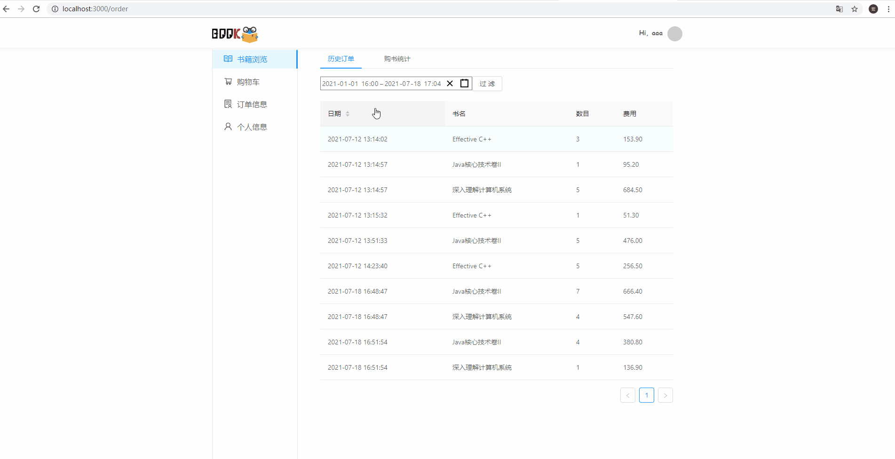
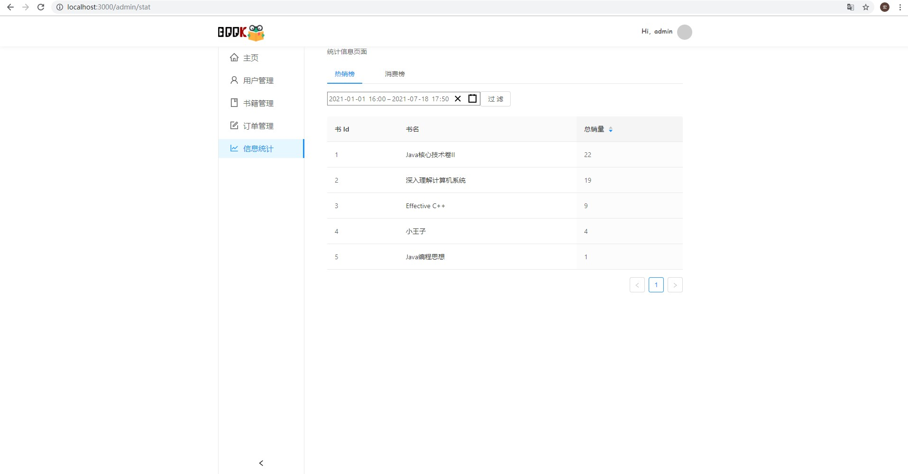

# Online Bookstore

使用React、Spring和MySQL开发的在线书店，前后端分离。

## 技术栈
* 前端：ReactJS，CSS
* 后端：Spring Boot, JPA, MySQL
* 开发工具：VSCode，Intellij IDEA，DataGrip

## 运行方法
* 后端配置

* 前端

* 数据库配置

<<<<<<< HEAD
## 功能展示
### 1. 用户功能
#### 1a. 登录和注册

#### 1b. 查看书籍详情，并将书添加到购物车

#### 1c. 查看购物车，结账

#### 1d. 查看订单信息

### 1e. 书籍搜索功能（前端发字符，后端完成字符串匹配）

### 1f. 订单日期过滤功能（前端发时间段，后端过滤返回）

### 2. 管理员功能
#### 2a. 管理员登录

#### 2b. 用户管理

#### 2c. 书籍管理(搜索在前端完成)

#### 2d. 订单管理

#### 2e. 信息统计

## 详细功能清单
### 用户管理
* 管理员身份登录后，可以看到该功能；用户分为两种角色：顾客和管理员。
* 管理员可以禁用/解禁用户，被禁用的用户将无法登录系统。  
### 用户登录与注册
* 用户登录需要输入用户名和密码，未输入点登录按钮时，提示用户必须输入。
* 被禁用用户无法登录系统，并且会提示用户“您的账号已经被禁用”。
* 根据用户名来确认其为管理员还是顾客，不同角色的界面具有差异。
* 新用户注册时需要填写用户名、密码、重复密码、邮箱。
* 需要校验用户名是否重复、两次输入的密码是否相同、邮箱是否符合格式要求。
### 书籍管理
* 管理员身份登录后，可以看到该功能。
* 管理员可以浏览数据库中已有的书籍，以列表形式显示，包括书名、作
者、封面、ISBN 编号和库存量。
* 在列表上方提供搜索功能，管理员可以用书名来过滤想要查找的书籍。
* 管理员在列表中可以修改每本图书的上述各种属性，包括书名、作者、
封面、ISBN 编号和库存量。
* 管理员可以下架/删除旧图书，可以上架/添加新图书。
### 浏览书籍
* 顾客和管理员都可以浏览数据库中已有的书籍，以列表形式显示，包括
书名、作者、封面、ISBN 编号和库存量。
* 提供搜索功能，用户可以用书名来过滤想要查找的书籍。
* 选中某本书后，通过Ajax 方式获取并显示书的详细信息。
### 购买书籍
* 当用户浏览书籍时，可以选择将某本书放入购物车。
* 用户可以浏览购物车，看到自己放入购物车的所有书籍。
* 在购物车中点击购买书籍之后，清空购物车，同时书籍库存相应地减少。
* 购买书籍后，生成订单，展示给用户，并将订单存入数据库。
### 订单管理
* 顾客可以查看自己的所有订单，并且可以使用搜索功能来实现过滤，具
体可以按照时间范围或书籍名称过滤。
2) 管理员可以查看系统中所有的订单，并且可以使用搜索功能来实现过
滤，具体可以按照时间范围或书籍名称过滤。
### 统计
* 管理员可以统计在指定时间范围内各种书的销量情况，按照销售量排
序，形成热销榜，以图或表的方式呈现。
* 管理员可以统计在指定时间范围内每个用户的累计消费情况，按照购书
进行排序，形成消费榜，以图或表的方式呈现。
* 顾客可以统计在指定时间范围内自己购买书籍的情况 ，包括每种书购
买了多少本，购书总本数和总金额。
=======

## 已完成的功能
* 顾客
* 管理员

## 前端分层
* view
* component
* service
* utils

## 后端分层
* Controller
* Service
* DAO
* JPARepository

## TODOs

### 待优化的部分
* 书籍图片应当保存在后端数据库，而非url引用（Blob）。
* 书籍展示应当由后端分页获取，而非一次全部获取到前端。